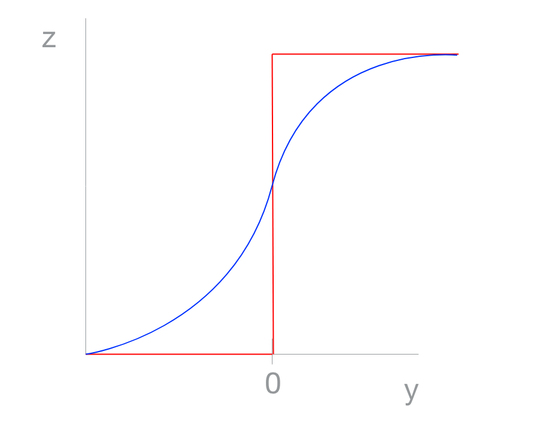
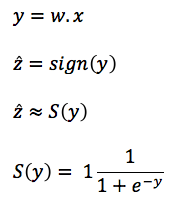
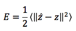
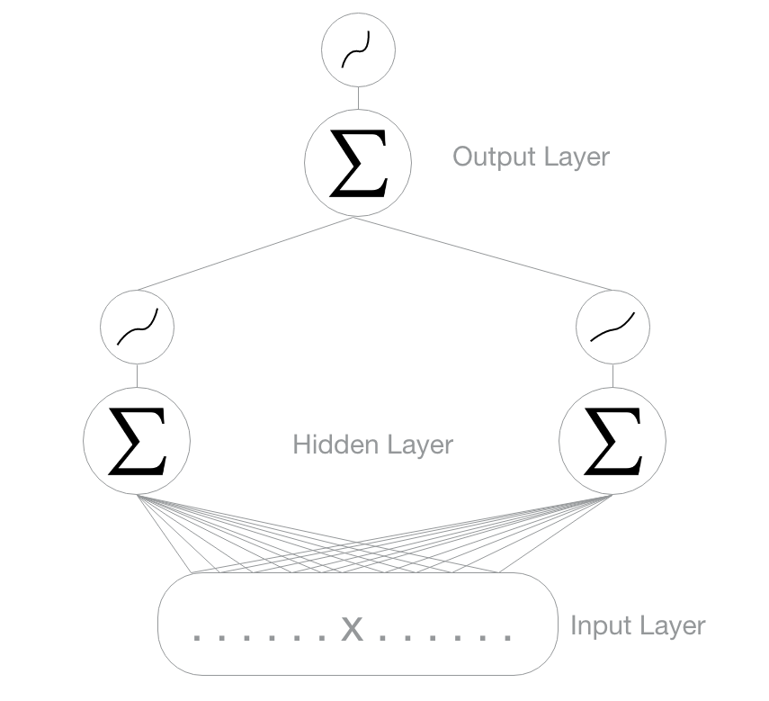
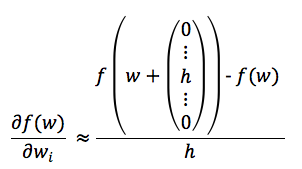
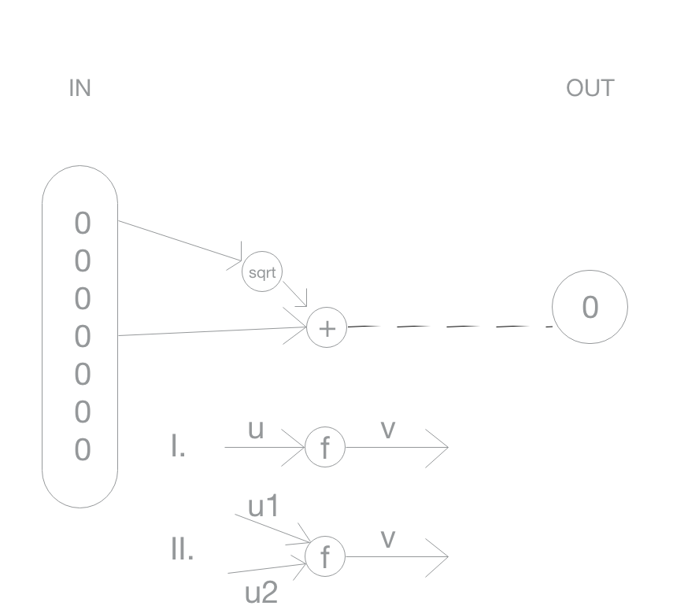
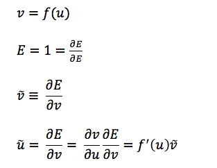
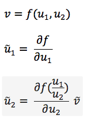
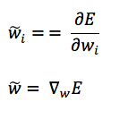

# CS401 - Machine Learning & Neural Network

## 23/10/17

### [Learning representations by back-propagation errors](https://www.iro.umontreal.ca/~vincentp/ift3395/lectures/backprop_old.pdf)

#### Limitation of the Perceptron:
Minksy & Papert: Perceptrons.
Emphasize what perceptrons can't do (negative theorems).
They introduce the concept of a multi-layered perceptron (and speculate that it is not possible).

It is possible and based on 2 tricks:

1. When learning, move the boundaries as less as possible to get the new data right.

Easy in linear systems but what's the consequences in a non-linear system?
We can make the system continuous to simplify that:

S is sigmoid function (continuous function).
The most used is the logistic function above.

Corresponding approximatly to the firing rate of a neuron.

The error become a continuous function of the weights:

Now, consider a multilayer perceptron:

Changing weight one by one:

Two problems here: 

    I. Never add numbers of different size
    II. Never substract number of similar size

This solution doesn't scale.

2. An efficient way to calculate the gradient.
(Multiple discovey 1968, 1979, 1983).

Let's take a flow graph:

Case I: One entry

Case II: Multiple entries

At the end of the back-propagation, we have:

 

Problems: 
- Some nodes have 2 outputs
- Difficult to verify the result

