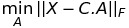

# K means clustering

K means is a clustering method, devised with the goal of finding patterns in data. 
The idea behind the algorithm is to partition the dataset into similar clusters, based on the mean distance of each point to the cluster centroid.

## Algorithm

Let *x*1,*x*2,...,*x*n be the variables in our dataset. Let _Si_ be a partition of the dataset, _i_<=_k_.
To find the _k_ cluster centers _Ci_ we want to minimise thew within cluster sum of squares (WCSS): 
   
That is, we want to find the argument which minimises the distance between each data point *x* and the mean of the points \mui in each partition _Si.
This will be our cluster center. We then iterate this minimisation until convergence. 

An interactive visualisation can be found at https://www.naftaliharris.com/blog/visualizing-k-means-clustering/

## Stochastic k-means vs Batch k-means

So far the only method for optimisation we have encountered was gradient descent. A *stochastic* k-means algorithm would involve moving the centroid one step at a time towards the true center. While this solves the problems, it is computationally expensive.
Instead, a *batch* algorithm is used. This involves computing the mean of the data points and moving the centroid to the true center in one step. This converges much faster than the stochastic version

## Matrix representation

Another way to describe this algorithm, is by representing the data set as a _n_x_m_ matrix. Let 
  
be our dataset as a _n_x_m_ matrix. After running the k-means algorithm, we will have the following centroid matrix 
 
 
Then we can approximate *X* as the product between the centroid matrix *C* and the assignment matrix *A*, which is given by  
 
I.e. is a _k_x_m_ matrix with only one element of each column being 1 and the rest are 0. 
Thus the problem becomes finding , where _F_ is the Frobenius norm.
